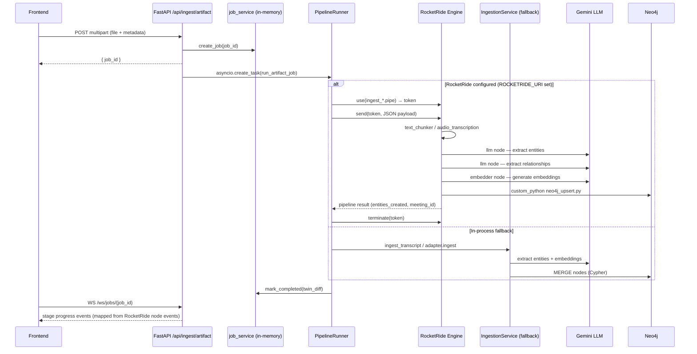
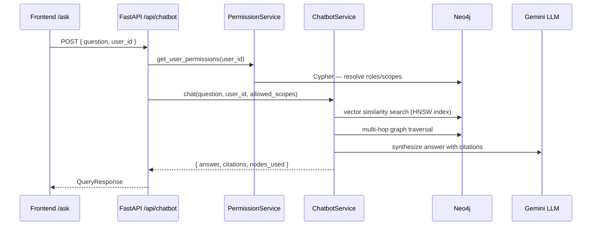
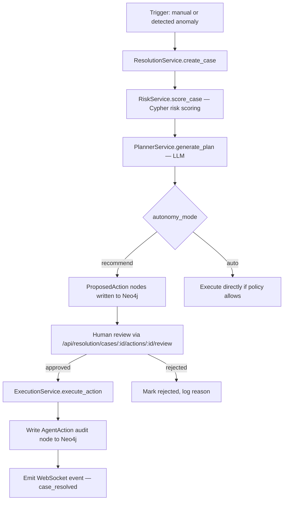

# digiTwin

Permission-aware decision intelligence for enterprise teams.

digiTwin turns organizational activity (meetings, docs, tickets, approvals) into a living knowledge graph of **who decided what, why, what depends on it, and who is authorized to act on it** — then lets agents execute follow-ups against that graph with full auditability and least-privilege enforcement.

---

## Features

- **Multi-artifact ingestion** — transcripts, PRDs, policy docs, audio/video, GitHub repos, and generic text; auto-classified on upload
- **Knowledge graph extraction** — LLM-powered entity and relationship extraction into Neo4j (decisions, assumptions, evidence, tasks, approvals, risks, and more)
- **Hybrid retrieval (GraphRAG)** — vector similarity search combined with multi-hop Cypher traversal for explainable, citation-grounded answers
- **Permission graph** — users, roles, scopes, delegation chains, and approval requirements stored directly in Neo4j alongside the knowledge graph
- **Policy-gated agent actions** — every side-effecting action checks the permission subgraph before execution; blocked actions are queued for human review
- **Autonomous Resolution Engine** — detects contradicted assumptions, blocked dependencies, and overdue approvals; generates LLM plans and walks them through an approve/execute loop
- **Real-time streaming** — ingestion and resolution progress streamed over WebSocket; frontend polls via TanStack Query
- **RocketRide pipeline engine** — portable JSON pipelines (`.pipe`) model every ingestion and policy-check workflow as an executable DAG; the FastAPI backend delegates to a running RocketRide engine when configured, with transparent fallback to in-process execution
- **Graph-first UI** — Next.js 14 app with dependency map, decision timeline, permission inspector, audit log, chatbot, and review inbox

---

## Quickstart

### Prerequisites

- Docker and Docker Compose
- A [Google AI Studio](https://aistudio.google.com/) API key (Gemini)

### 1. Configure environment

```bash
cp .env.example .env
# Edit .env — set GEMINI_API_KEY at minimum
```

| Variable | Default | Description |
|---|---|---|
| `NEO4J_URI` | `bolt://localhost:7687` | Neo4j Bolt connection string |
| `NEO4J_USER` | `neo4j` | Neo4j username |
| `NEO4J_PASSWORD` | `digitwin2026` | Neo4j password |
| `GEMINI_API_KEY` | — | **Required.** Google Gemini API key |
| `ENVIRONMENT` | `development` | Runtime environment |
| `GITHUB_ACCESS_TOKEN` | — | Personal Access Token for GitHub repo ingestion (Option A) |
| `GITHUB_APP_ID` | — | GitHub App ID for org-level access (Option B) |
| `GITHUB_APP_PRIVATE_KEY` | — | GitHub App private key (Option B) |
| `GITHUB_INSTALLATION_ID` | — | GitHub App installation ID (Option B) |
| `ROCKETRIDE_URI` | `ws://localhost:5565` | WebSocket URI of the RocketRide engine. Leave empty to use in-process execution instead. |
| `ROCKETRIDE_APIKEY` | `digitwin-local` | Shared secret between the backend and the RocketRide engine. Must match the engine's `ROCKETRIDE_APIKEY`. |

### 2. Start all services

```bash
make dev
# equivalent to: docker-compose up --build
```

This starts:
- **Neo4j 5.18** at `http://localhost:7474` (Bolt: `7687`) — with APOC plugin
- **RocketRide engine** at `ws://localhost:5565` — executes `.pipe` DAGs
- **FastAPI backend** at `http://localhost:8000`
- **Next.js frontend** at `http://localhost:3001`

### 3. Seed demo data (optional)

```bash
# In a separate terminal, after services are healthy:
cd scripts
python seed_demo.py
```

### 4. Open the app

Navigate to [http://localhost:3001](http://localhost:3001).

---

## Development

### Backend only

```bash
make dev-backend
# equivalent to: cd backend && uvicorn app.main:app --reload --port 8000
```

Requires a running Neo4j instance. Use `docker-compose up neo4j` to start only Neo4j.

### Frontend only

```bash
make dev-frontend
# equivalent to: cd frontend && npm run dev
```

Set `NEXT_PUBLIC_API_URL=http://localhost:8000` in `frontend/.env.local`.

### Run tests

```bash
make test                # all backend tests
make eval                # full evaluation harness
make eval-extraction     # extraction accuracy only
make eval-citations      # citation faithfulness only
make eval-permissions    # permission correctness only
```

---

## Architecture

```
┌─────────────────────────────────────────────────────────┐
│                     Next.js Frontend                    │
│  Dashboard · Ask · Dependency Map · Permissions · Audit │
└──────────────────────────┬──────────────────────────────┘
                           │ HTTP / WebSocket
┌──────────────────────────▼──────────────────────────────┐
│                   FastAPI Backend                       │
│  /api/ingest  /api/chatbot  /api/permissions            │
│  /api/resolution  /api/actions  /api/graph  /api/query  │
└──────┬─────────────────────────┬──────────┬─────────────┘
       │ pipeline_runner         │ Bolt     │ google-genai
       │ (WebSocket SDK)         │          │
┌──────▼──────────────┐  ┌──────▼──────┐  ┌▼──────────────┐
│  RocketRide Engine  │  │  Neo4j 5.18 │  │ Gemini (LLM + │
│  Executes .pipe DAGs│  │  Knowledge  │  │ Embeddings)   │
│  custom_python nodes│  │  Permission │  └───────────────┘
│  ws://…:5565        │  │  Vector idx │
└──────┬──────────────┘  └─────────────┘
       │ Bolt (custom nodes)
       └──────────────────────►  Neo4j 5.18 (same instance)
```

> **Fallback:** when `ROCKETRIDE_URI` is empty the backend executes the same
> pipeline logic in-process via `IngestionService` and the adapter layer —
> no behaviour change for local development without the engine.

### Request flow — ingestion



### Request flow — chatbot query



### Autonomous Resolution Engine flow



---

## Repository layout

```
.
├── backend/
│   ├── app/
│   │   ├── main.py                  # FastAPI app, router registration, lifespan
│   │   ├── config.py                # Settings (pydantic-settings, reads .env)
│   │   ├── dependencies.py          # FastAPI DI: get_driver, get_llm
│   │   ├── routers/                 # One file per API surface
│   │   │   ├── ingest.py            # POST /api/ingest/artifact (+ legacy endpoints)
│   │   │   ├── chatbot.py           # POST /api/chatbot
│   │   │   ├── graph.py             # GET /api/graph
│   │   │   ├── permissions.py       # GET/POST /api/permissions
│   │   │   ├── actions.py           # Agent action CRUD
│   │   │   ├── artifacts.py         # Artifact list / detail
│   │   │   ├── query.py             # Raw graph query
│   │   │   ├── resolution.py        # Autonomous Resolution Engine
│   │   │   ├── webhooks.py          # GitHub webhook intake
│   │   │   └── ws.py                # WebSocket job-progress stream
│   │   ├── services/
│   │   │   ├── ingestion_service.py # Transcript chunking, LLM extraction, graph writes
│   │   │   ├── artifact_router.py   # Routes artifact type → correct adapter
│   │   │   ├── graph_service.py     # Core Neo4j MERGE/MATCH helpers
│   │   │   ├── retrieval_service.py # Hybrid vector + graph retrieval
│   │   │   ├── chatbot_service.py   # GraphRAG chat loop
│   │   │   ├── permission_service.py# Permission checks, simulation, delegation
│   │   │   ├── resolution_service.py# Resolution case lifecycle
│   │   │   ├── planner_service.py   # LLM plan generation for resolution
│   │   │   ├── risk_service.py      # Risk scoring via Cypher
│   │   │   ├── execution_service.py # Safe action execution
│   │   │   ├── diff_service.py      # Twin diff (before/after graph snapshots)
│   │   │   ├── job_service.py       # In-memory job state + WebSocket emitter
│   │   │   ├── pii_service.py       # Optional PII redaction
│   │   │   ├── pipeline_runner.py   # RocketRide SDK bridge; falls back to in-process
│   │   │   └── adapters/            # Per-artifact-type ingestion adapters
│   │   ├── extraction/              # LLM extraction pipeline helpers
│   │   ├── graph_schema/
│   │   │   ├── indexes.cypher       # Vector, fulltext, and property indexes
│   │   │   └── constraints.cypher   # Node uniqueness constraints
│   │   ├── llm/
│   │   │   ├── base.py              # LLMProvider abstract interface
│   │   │   └── gemini_provider.py   # Gemini implementation
│   │   ├── models/                  # Pydantic request/response models
│   │   └── prompts/                 # Plain-text LLM prompt templates
│   ├── tests/eval/                  # Evaluation harness (extraction, citations, permissions)
│   └── pyproject.toml
├── frontend/
│   ├── app/                         # Next.js 14 App Router pages
│   │   ├── page.tsx                 # Dashboard
│   │   ├── ask/                     # Graph-grounded chatbot
│   │   ├── artifacts/               # Ingested artifact browser
│   │   ├── decisions/               # Decision cards and detail
│   │   ├── dependency-map/          # Interactive Sigma.js knowledge graph
│   │   ├── permissions/             # User permission inspector
│   │   ├── actions/                 # Agent action center
│   │   ├── resolution/              # Autonomous Resolution Engine UI
│   │   ├── audit/                   # Full audit log
│   │   ├── review/                  # Human review inbox
│   │   ├── timeline/                # Decision timeline
│   │   └── jobs/                    # Ingestion job progress
│   ├── components/
│   │   ├── graph/                   # Sigma.js graph viewer + legend
│   │   ├── chatbot/                 # Chat panel components
│   │   ├── dashboard/               # Dashboard widgets
│   │   ├── pipeline/                # Ingestion pipeline UI
│   │   ├── shared/                  # MetricCard, EntityCard, StatusBadge, etc.
│   │   └── ui/                      # shadcn/ui primitives
│   └── lib/
│       ├── api.ts                   # Typed fetch wrappers for all endpoints
│       ├── hooks.ts                 # TanStack Query hooks
│       └── types.ts                 # Shared TypeScript types
├── pipelines/                       # RocketRide pipeline definitions (.pipe JSON)
│   ├── ingest_transcript.pipe       # Transcript → Neo4j
│   ├── ingest_prd.pipe              # PRD document → Neo4j
│   ├── ingest_policy_doc.pipe       # Policy doc → Neo4j
│   ├── ingest_repo.pipe             # GitHub repo → Neo4j
│   ├── ingest_audio.pipe            # Audio/video → transcription → Neo4j
│   ├── check_policy.pipe            # Permission check sub-pipeline
│   ├── draft_followups.pipe         # Draft follow-up messages
│   └── nodes/                       # Custom Python nodes used by pipelines
│       ├── neo4j_upsert.py          # Writes extracted entities to Neo4j
│       ├── neo4j_query.py           # Reads graph context for retrieval
│       ├── permission_check.py      # Resolves permissions + delegation
│       ├── provenance_register.py   # Upserts Artifact + ArtifactVersion nodes
│       ├── github_auth.py           # GitHub App JWT auth + repo file enumeration
│       └── code_parser.py           # Python AST + regex symbol extraction
├── scripts/
│   ├── init_neo4j.py                # Applies indexes.cypher and constraints.cypher
│   ├── seed_demo.py                 # Loads demo graph for local development
│   └── run_ingestion.py             # CLI to trigger ingestion outside the API
├── data/
│   ├── demo_graph.json              # Demo graph seed data
│   ├── sample_transcript.txt        # Example transcript for testing
│   └── sample_permissions.json      # Example permission graph seed
├── docs/
│   └── neo4j-fgac.md                # Fine-grained access control design notes
├── docker-compose.yml
├── Makefile
└── .env.example
```

---

## Neo4j graph schema

### Knowledge graph node labels

| Label | Key properties |
|---|---|
| `Decision` | `id`, `title`, `summary`, `status`, `confidence`, `embedding` |
| `Assumption` | `id`, `text`, `status`, `embedding` |
| `Evidence` | `id`, `content_summary`, `source_url`, `embedding` |
| `Meeting` | `id`, `title`, `date`, `participants` |
| `Task` | `id`, `title`, `status`, `owner_id` |
| `Approval` | `id`, `status`, `required_by`, `approved_by` |
| `Document` | `id`, `title`, `source_url`, `embedding` |
| `Risk` | `id`, `description`, `severity` |
| `AgentAction` | `id`, `action_type`, `status`, `initiated_by`, `timestamp` |
| `ResolutionCase` | `id`, `title`, `case_type`, `status`, `severity`, `autonomy_mode` |

### Permission graph node labels

| Label | Key properties |
|---|---|
| `Person` | `id`, `name`, `email`, `department` |
| `Role` | `id`, `name`, `scope` |
| `Permission` | `id`, `action`, `resource_type` |
| `Scope` | `id`, `name` |
| `Delegation` | `id`, `delegator_id`, `delegatee_id`, `expires_at` |

### Core relationship types

`MADE_DECISION` · `SUPPORTED_BY` · `CONTRADICTED_BY` · `BLOCKS` · `DEPENDS_ON` · `REQUIRES_APPROVAL_FROM` · `OWNED_BY` · `AFFECTS` · `CAN_VIEW` · `CAN_EDIT` · `CAN_EXECUTE` · `DELEGATED_TO` · `ACTED_ON_BEHALF_OF` · `ABOUT` · `HAS_ROLE` · `HAS_PERMISSION`

### Vector indexes

All embeddings are 768-dimensional (Gemini `gemini-embedding-001`, cosine similarity, HNSW). Indexed node types: `Decision`, `Assumption`, `Evidence`, `Document`, `Chunk`, `Symbol`, `Policy`, `Requirement`.

---

## RocketRide pipelines

The `pipelines/` directory contains portable JSON pipeline definitions (`.pipe`) that model every ingestion and policy-check workflow as a DAG. When a RocketRide engine is running, the FastAPI backend delegates execution to it via the [RocketRide Python SDK](https://pypi.org/project/rocketride/); otherwise the same logic runs in-process.

### How the integration works

`backend/app/services/pipeline_runner.py` is the bridge:

1. **`PipelineRunner.is_available()`** — returns `True` when both `ROCKETRIDE_URI` and `ROCKETRIDE_APIKEY` are set.
2. **`PipelineRunner.pipe_path_for(artifact_type)`** — maps an artifact type to its `.pipe` file on disk.
3. **`PipelineRunner.run_pipe(pipe_path, payload, ...)`** — opens an async `RocketRideClient`, calls `use()` → `set_events()` → `send()` → `terminate()`. RocketRide node events (`apaevt_node_started` / `apaevt_node_completed`) are translated into internal `job_service` stage events so the frontend job tracker updates in real time regardless of execution mode.

When `ROCKETRIDE_URI` is empty the `_run_ingest_job` / `_run_artifact_job` background tasks fall back to `IngestionService` and the adapter layer — no code changes required.

### Pipeline → artifact type mapping

| Artifact type | Pipeline file |
|---|---|
| `transcript` | `ingest_transcript.pipe` |
| `prd` · `rfc` · `postmortem` | `ingest_prd.pipe` |
| `audio` · `video` | `ingest_audio.pipe` |
| `github_repo` | `ingest_repo.pipe` |
| `policy_doc` · `contract` · `generic_text` | `ingest_policy_doc.pipe` |

### Pipeline descriptions

| Pipeline | Node sequence |
|---|---|
| `ingest_transcript.pipe` | `webhook` → `text_chunker` → `llm` (entity extraction) → `llm` (relationship extraction) → `embedder` → `custom_python` neo4j_upsert → `custom_python` audit |
| `ingest_prd.pipe` | `webhook` → `pii_anonymizer` → `custom_python` provenance_register → `llm` (PDF layout) → `text_chunker` → `llm` (entities) → `llm` (relationships) → `embedder` → `custom_python` neo4j_upsert → audit |
| `ingest_policy_doc.pipe` | Same shape as `ingest_prd.pipe` with policy-specific prompts |
| `ingest_repo.pipe` | `webhook` → `custom_python` github_auth → `custom_python` github_auth (enumerate) → `custom_python` code_parser → `llm` (architecture) → `embedder` → `custom_python` neo4j_upsert → audit |
| `ingest_audio.pipe` | `webhook` → `custom_python` provenance_register → `audio_transcription` → `text_chunker` → `llm` (entities) → `llm` (relationships) → `embedder` → `custom_python` neo4j_upsert → audit |
| `check_policy.pipe` | `passthrough` → `custom_python` permission_check → `custom_python` permission_check (delegation) |
| `draft_followups.pipe` | `webhook` → `custom_python` neo4j_query (blocked approvals) → `sub_pipeline` check_policy → `llm` (draft messages) → `custom_python` neo4j_upsert (audit) |

### Node types used

| Type | Source |
|---|---|
| `webhook`, `text_chunker`, `llm`, `embedder`, `pii_anonymizer`, `audio_transcription`, `passthrough`, `sub_pipeline` | Built-in RocketRide nodes |
| `custom_python` | Scripts in `pipelines/nodes/` |

### Custom Python nodes

| Script | Purpose |
|---|---|
| `neo4j_upsert.py` | Upserts extracted entities (decisions, assumptions, evidence, persons) into Neo4j; also creates `AgentAction` audit records |
| `neo4j_query.py` | Runs parameterised Cypher queries and returns results as JSON for downstream nodes |
| `permission_check.py` | Resolves direct role grants and delegation chains in the permission subgraph |
| `provenance_register.py` | Creates or updates `Artifact` and `ArtifactVersion` nodes with content hash and model version |
| `github_auth.py` | Exchanges GitHub App credentials for an installation token (falls back to PAT); enumerates a repo's file tree filtered by extension |
| `code_parser.py` | Fetches source files from GitHub and extracts symbols (Python AST; TypeScript/Go regex heuristics) |

### LLM and embedding models

All pipelines use Gemini, resolved from environment variables set on the engine:

| Variable | Default | Used for |
|---|---|---|
| `GEMINI_MODEL` | `gemini-2.5-flash` | All `llm` nodes |
| `GEMINI_EMBEDDING_MODEL` | `gemini-embedding-001` | All `embedder` nodes |
| `TRANSCRIPTION_PROVIDER` | `gemini` | `audio_transcription` nodes |

### Running the engine

**Docker Compose (recommended):** the engine starts automatically as the `rocketride-engine` service.

```bash
docker-compose up --build
```

**Standalone Docker:**

```bash
docker pull ghcr.io/rocketride-org/rocketride-engine:latest
docker run -p 5565:5565 \
  -v $(pwd)/pipelines:/pipelines \
  -e ROCKETRIDE_APIKEY=digitwin-local \
  -e GEMINI_API_KEY=$GEMINI_API_KEY \
  -e NEO4J_URI=bolt://host.docker.internal:7687 \
  -e NEO4J_USER=neo4j \
  -e NEO4J_PASSWORD=digitwin2026 \
  ghcr.io/rocketride-org/rocketride-engine:latest
```

**Disable RocketRide** (use in-process execution only):

```bash
# In .env — remove or blank out ROCKETRIDE_URI
ROCKETRIDE_URI=
```

---

## API reference

### Health

```
GET /health
→ { "status": "ok", "service": "digiTwin" }
```

### Ingestion

| Method | Path | Description |
|---|---|---|
| `POST` | `/api/ingest/artifact` | Upload a file or form fields; returns `job_id` immediately |
| `POST` | `/api/ingest/artifact/url` | Ingest from URL, GCS path, or GitHub repo reference |
| `POST` | `/api/ingest/bundle` | Ingest multiple artifacts in parallel; returns list of `job_id`s |
| `GET` | `/api/ingest/github/branches` | List branches and default branch for a GitHub repo URL |
| `GET` | `/api/ingest/jobs` | List recent ingestion jobs |
| `GET` | `/api/ingest/jobs/{job_id}` | Get job state and stage progress |
| `WS` | `/ws/jobs/{job_id}` | Stream real-time stage events for a job |

### Chatbot / Query

| Method | Path | Description |
|---|---|---|
| `POST` | `/api/chatbot` | Graph-grounded Q&A; respects `user_id` permission scopes |
| `POST` | `/api/query` | Raw graph query |

### Permissions

| Method | Path | Description |
|---|---|---|
| `GET` | `/api/permissions/user/{user_id}` | List all permissions for a user |
| `POST` | `/api/permissions/check` | Check whether a user can perform `action` on `resource_id` |
| `POST` | `/api/permissions/simulate` | Test a hypothetical permission change (read-only rollback) |

### Resolution (Autonomous Resolution Engine)

| Method | Path | Description |
|---|---|---|
| `POST` | `/api/resolution/resolve` | Trigger a resolution case for a target entity |
| `GET` | `/api/resolution/cases` | List cases; filter by `status`, `severity`, `case_type` |
| `GET` | `/api/resolution/cases/{case_id}` | Full case detail with plan and proposed actions |
| `POST` | `/api/resolution/cases/{case_id}/actions/{action_id}/review` | Approve or reject a proposed action |
| `POST` | `/api/resolution/cases/{case_id}/actions/{action_id}/execute` | Execute an approved action |
| `POST` | `/api/resolution/cases/{case_id}/stop` | Cancel a case |
| `WS` | `/api/resolution/ws/{case_id}` | Stream live resolution events |

### Graph

| Method | Path | Description |
|---|---|---|
| `GET` | `/api/graph/overview` | All nodes and edges for the dependency map (scoped by `workspace`) |
| `GET` | `/api/graph/decisions` | List all decisions |
| `GET` | `/api/graph/decisions/{id}/lineage` | Subgraph of a decision's full lineage |
| `GET` | `/api/graph/decisions/{id}/impact` | Compute impact score for a decision |
| `GET` | `/api/graph/timeline` | Decisions ordered by `created_at` with contradiction counts |

### Artifacts

| Method | Path | Description |
|---|---|---|
| `GET` | `/api/artifacts` | List active (non-archived) artifacts; filter by `workspace_id`, `artifact_type` |
| `GET` | `/api/artifacts/archived` | List archived artifacts |
| `GET` | `/api/artifacts/{id}` | Single artifact with version history |
| `GET` | `/api/artifacts/{id}/chunks` | Text chunks for an artifact (without embeddings) |
| `GET` | `/api/artifacts/{id}/diff` | Diff between the two most recent versions |
| `POST` | `/api/artifacts/{id}/archive` | Archive an artifact (hides from main dashboard) |
| `POST` | `/api/artifacts/{id}/unarchive` | Restore an archived artifact |
| `DELETE` | `/api/artifacts/{id}` | Permanently delete an artifact and all associated data |

### Actions & Webhooks

| Method | Path | Description |
|---|---|---|
| `POST` | `/api/actions/draft-followups` | Draft policy-enforced follow-up messages |
| `GET` | `/api/actions/history` | Last 50 agent actions ordered by timestamp |
| `GET` | `/api/actions/review-inbox` | Pending human review tasks |
| `POST` | `/api/actions/review/{id}/approve` | Approve or reject a review task (re-runs draft on approval) |
| `POST` | `/api/webhooks/github` | GitHub webhook intake (push, PR events) |

---

## Frontend pages

| Route | Description |
|---|---|
| `/` | Dashboard — metrics, recent decisions, mini graph, agent activity |
| `/ask` | Graph-grounded chatbot with cited answers |
| `/artifacts` | Ingested artifact browser with upload modal |
| `/decisions` | Decision cards; filter by status and owner |
| `/decisions/[id]` | Decision detail — assumptions, evidence, approvals, lineage |
| `/dependency-map` | Interactive Sigma.js force-directed knowledge graph |
| `/permissions` | User permission inspector and policy simulator |
| `/actions` | Agent action center |
| `/resolution` | Autonomous Resolution Engine — case list and detail |
| `/audit` | Full agent action replay log |
| `/review` | Human review inbox — approve or reject blocked actions |
| `/timeline` | Decision timeline |
| `/jobs/[id]` | Ingestion job progress with stage-by-stage detail |

---

## Supported artifact types

| Type | Ingestion adapter | What gets extracted |
|---|---|---|
| `transcript` | `IngestionService` | Decisions, assumptions, evidence, tasks, approvals, persons |
| `prd` | `PrdAdapter` | Requirements, product goals, decisions, risks |
| `policy_doc` | `PolicyAdapter` | Policy rules, obligations, permission constraints |
| `github_repo` | `RepoAdapter` | Repository, files, symbols, dependencies |
| `audio` / `video` | `AudioAdapter` | Transcription → transcript pipeline |
| `generic_text` | `GenericTextAdapter` | Decisions, assumptions, evidence |

The `artifact_classifier` module auto-detects type from MIME type, filename, or a content preview when not explicitly provided.

---

## Security model

Permissions are first-class graph entities in Neo4j, not a separate opaque system:

- `Person -[:HAS_ROLE]-> Role -[:HAS_PERMISSION]-> Permission`
- `Permission -[:SCOPED_TO]-> Scope`
- `Person -[:DELEGATED_TO {expires_at}]-> Person`

Every agent action that has side effects resolves the full permission path through Cypher before executing. The `PermissionService.check_permission` method returns:

```json
{
  "allowed": true,
  "policy_path": ["user:alice", "role:pm", "permission:draft_followup", "scope:marketing-q2"],
  "requires_approval": false,
  "approver": null,
  "reason": "Direct role grant within scope"
}
```

Blocked actions are written as `AgentAction {status: "blocked"}` nodes, surfaced in the review inbox, and never silently dropped.

---

## Troubleshooting

**Neo4j connection refused on startup**

The backend waits for Neo4j's healthcheck (`RETURN 1` via `cypher-shell`). If it fails, check that the Neo4j container is healthy: `docker-compose ps`. The default password is `digitwin2026`; change it in `.env` and update `docker-compose.yml` accordingly.

**`GEMINI_API_KEY` not set**

Ingestion and chatbot endpoints will return 500 with a key-missing error. Set `GEMINI_API_KEY` in `.env` before starting the backend.

**Embeddings shape mismatch**

Vector indexes are configured for either 768 or 3072 dimensions depending on the node that wrote them (`ingest_transcript.pipe` uses 3072; document pipes use 768). If you change the embedding model, run `scripts/init_neo4j.py` to drop and recreate the indexes with the correct dimensions.

**RocketRide engine not reachable**

If the backend logs `ConnectionException` or `RocketRide not available`, check:
1. The `rocketride-engine` container is running: `docker-compose ps rocketride-engine`
2. `ROCKETRIDE_URI` matches the engine's address (default `ws://localhost:5565` locally, `ws://rocketride-engine:5565` inside Docker Compose)
3. `ROCKETRIDE_APIKEY` is the same value on both the engine and the backend

The backend will automatically fall back to in-process execution if the engine is unreachable and `ROCKETRIDE_URI` is empty. If you want to force in-process mode, set `ROCKETRIDE_URI=` in `.env`.

**RocketRide custom node fails with `ModuleNotFoundError`**

The engine runs custom Python nodes as subprocesses. Ensure `neo4j` (and `cryptography` for GitHub App JWT signing) are installed in the engine's Python environment. Add them to the engine's node dependency list or use the engine's built-in package installation mechanism.

**Frontend cannot reach backend**

The Next.js app expects the backend at `NEXT_PUBLIC_API_URL` (default `http://localhost:8000`). When running in Docker Compose the frontend calls the host machine's port 8000; ensure nothing else occupies that port.

**GitHub ingestion fails**

Use Option A: set `GITHUB_ACCESS_TOKEN` (personal access token with `repo` scope). Use Option B for org-level or production access: set `GITHUB_APP_ID`, `GITHUB_APP_PRIVATE_KEY`, and `GITHUB_INSTALLATION_ID` in `.env`. Only one option needs to be configured.
